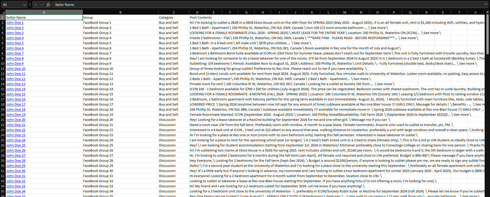

# Sublet Facebook Scraper

> A selenium-powered web scraper to simplify the housing search for Waterloo co-op students

## Project Features
* Fully-automated web scraper that uses BeautifulSoup4 scrapes the feed of Facebook groups to extract...
  * The poster's full name
  * The poster's profile URL
  * Contents of the post
* Optimized to maximize extraction yield, allowing for ~22 posts to be extracted per Facebook group category (i.e., "Discussion", "Buy and Sell")
* Extracted data gets outputed to a `xlsx` file for easy further processing


## How To Use
1. Make a copy of `config.txt` and rename it to `config.json`
1. Follow the instructions inside of the copied `config.json` and populate the empty values
1. Close all instances of Chrome (prior to running this script; assuming one is signed into Facebook)
1. Create a Python venv (recommended) and install `pip` packages
1. Start the scraper by running:
```
python3 main.py
```
